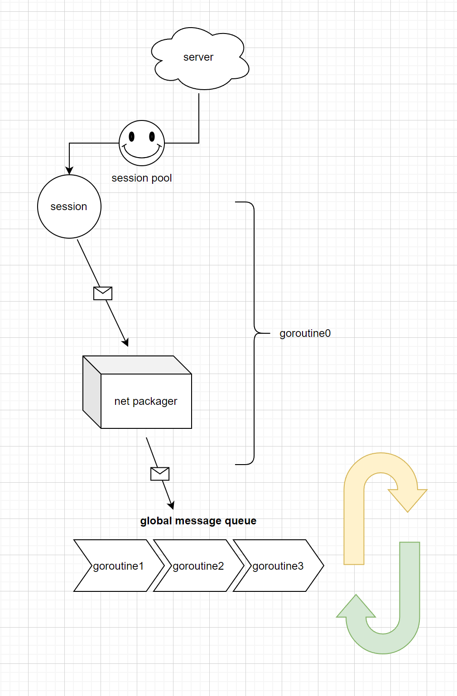

## version
 `v3.1.0`
 
## 介绍
一个基于go语言开发的网络脚手架,参考[cellnet](https://github.com/davyxu/cellnet)和[gin](https://github.com/gin-gonic/gin) 两大开框架的设计，使用非常方便简洁，轻松让你开发出高并发高性能的网络应用，可以用于游戏,app等任何领域的通讯。

## 主要技术理念
- Session pool 会话池
- Goroutine pool  消息处理协程池
- Message cache layer 消息缓存层
- Message sequence 消息排序

## 架构图



## 主要特性及追求目标
- 高并发
- 高性能
- 简单易用
- 线性安全
- 兼容性强
- 高度可配置
- 多领域应用
- 防崩溃
- 错误快速定位

## 通讯协议支持
- [x] TCP
- [x] UDP
- [x] WEBSOCKET
- [x] QUIC
- [x] KCP

## 数据编码格式支持
- [x] json
- [x] xml
- [x] binary
- [x] protobuf


## 安装教程
### **1.** git clone到 GOPATH/src目录下

```
git clone https://github.com/flylib/gonet.git
```

## 使用样例参考
```go
//main.go
package main

import (
	"github.com/flylib/gonet"
	"github.com/flylib/gonet/demo/handler"
	"github.com/flylib/gonet/transport/ws" //协议
	"log"
)

func main() {
	//server run context
	ctx := gonet.NewContext(
		gonet.WithMessageHandler(MessageHandler),
		gonet.MustWithSessionType(transport.SessionType()),
		gonet.MustWithCodec(&json.Codec{}),
		gonet.MustWithLogger(builtinlog.NewLogger()),
	)
	fmt.Println("server listen on ws://localhost:8088/center/ws")
	//server listen
	if err := transport.NewServer(ctx).Listen("ws://localhost:8088/center/ws"); err != nil {
		log.Fatal(err)
	}
}


// 消息路由
func MessageHandler(msg gonet.IMessage) {
	s := msg.From()
	switch msg.ID() {
	case gonet.MessageID_Connection_Connect:
		log.Println("connected session_id:", s.ID(), " ip:", s.RemoteAddr().String())
	case gonet.MessageID_Connection_Close:
		log.Println("connected session_id:", s.ID(), " error:", msg.Body())
	case 101:
		pb := proto.Say{}
		err := msg.UnmarshalTo(&pb)
		if err != nil {
			panic(err)
		}
		fmt.Println("session_id:", s.ID(), " say ", pb.Content)
		err = s.Send(102, proto.Say{Content: "hell client"})
		if err != nil {
			log.Fatal(err)
		}
	case 102:
		pb := proto.Say{}
		err := msg.UnmarshalTo(&pb)
		if err != nil {
			panic(err)
		}
		fmt.Println("session_id:", s.ID(), " say ", pb.Content)
	default:
		log.Println("unknown message id:", msg.ID())
	}
}

```


## 测试
## FAQ
## 参与贡献
#### QQ群：795611332

