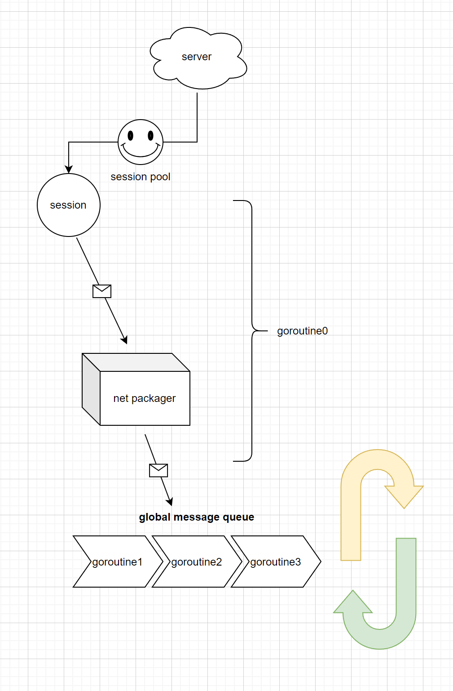

# GoNet

> 高性能、泛型驱动的 Go 网络框架

[](https://go.dev/)
[]()

## 简介

GoNet 是一个基于 Go 语言开发的网络框架，参考 [cellnet](https://github.com/davyxu/cellnet) 和 [gin](https://github.com/gin-gonic/gin) 的设计理念，借助 Go 1.18+ 泛型实现类型安全的会话管理。适用于游戏服务器、即时通讯、物联网等高并发网络场景。

## 架构



### 核心设计

| 特性 | 说明 |
|------|------|
| **Session Pool** | 会话对象池化，减少 GC 压力 |
| **Goroutine Pool** | 分片消息队列，按 SessionID 取模路由，保证消息有序 |
| **Message Pool** | 消息对象池化复用 |
| **Body Buffer Pool** | 可选的消息体缓冲池 |

### 报文格式

```
+--------------------+----------------+------------------+
| body length (2B)   |  msg ID (4B)   |  body (N bytes)  |
+--------------------+----------------+------------------+
         ↑ uint16 LE        ↑ uint32 LE       ↑ 序列化后的消息体
```

- Header 固定 6 字节，`body length` 字段 = `MsgIDOffset(4) + len(body)`
- 单包最大 payload: 65529 字节 (0xFFFF - 6)

## 特性

- **多协议支持** — TCP / UDP / WebSocket / QUIC / KCP / gnet
- **多编码格式** — JSON / XML / Binary / Protobuf（通过 `ICodec` 接口扩展）
- **泛型上下文** — `AppContext[S]` 类型安全，编译期检查会话类型
- **高度可配置** — 连接上限、协程池、队列深度、缓冲池容量均可调
- **线程安全** — Session 发送加锁、消息按会话分片有序处理
- **防崩溃** — 内置 panic recovery，错误回调隔离

## 快速开始

### 安装

```bash
go get github.com/flylib/gonet@latest

# 选择一种 WebSocket 传输层
go get github.com/flylib/gonet/transport/fastws@latest      # 推荐：基于 fasthttp/websocket
go get github.com/flylib/gonet/transport/gorillaws@latest    # 基于 gorilla/websocket
```

### 定义消息与事件处理器

```go
// proto/message.go
package proto

const MsgID_Say = 101

type Say struct {
    Content string `json:"content"`
}
```

```go
// handler/handler.go
package handler

import (
    "fmt"

    "your-project/proto"
    "github.com/flylib/gonet"
)

type EventHandler struct{}

func (h EventHandler) OnConnect(session gonet.ISession) {
    fmt.Printf("[connect] session=%d remote=%s\n", session.ID(), session.RemoteAddr())
}

func (h EventHandler) OnClose(session gonet.ISession, err error) {
    fmt.Printf("[close] session=%d err=%v\n", session.ID(), err)
}

func (h EventHandler) OnMessage(msg gonet.IMessage) {
    switch msg.ID() {
    case proto.MsgID_Say:
        var say proto.Say
        if err := msg.UnmarshalTo(&say); err != nil {
            return
        }
        fmt.Printf("[msg] session=%d say: %s\n", msg.From().ID(), say.Content)
    }
}

func (h EventHandler) OnError(session gonet.ISession, err error) {
    fmt.Printf("[error] session=%d err=%v\n", session.ID(), err)
}
```

### 启动服务端

```go
package main

import (
    "fmt"
    "log"

    "your-project/handler"
    "github.com/flylib/gonet"
    transport "github.com/flylib/gonet/transport/fastws"
    "github.com/flylib/goutils/codec/json"
    "github.com/flylib/pkg/log/builtinlog"
)

func main() {
    ctx := gonet.NewAppContext(
        func() *transport.Session { return new(transport.Session) },
        gonet.WithEventHandler(handler.EventHandler{}),
        gonet.MustWithCodec(&json.Codec{}),
        gonet.MustWithLogger(builtinlog.NewLogger()),
    )

    addr := "ws://localhost:8088/ws"
    fmt.Println("server listen on", addr)
    if err := transport.NewServer(ctx).Listen(addr); err != nil {
        log.Fatal(err)
    }
}
```

### 启动客户端

```go
package main

import (
    "fmt"
    "log"
    "time"

    "your-project/handler"
    "your-project/proto"
    "github.com/flylib/gonet"
    transport "github.com/flylib/gonet/transport/fastws"
    "github.com/flylib/goutils/codec/json"
    "github.com/flylib/pkg/log/builtinlog"
)

func main() {
    ctx := gonet.NewAppContext(
        func() *transport.Session { return new(transport.Session) },
        gonet.WithEventHandler(handler.EventHandler{}),
        gonet.MustWithCodec(&json.Codec{}),
        gonet.MustWithLogger(builtinlog.NewLogger()),
    )

    session, err := transport.NewClient(ctx,
        transport.WithHandshakeTimeout(5*time.Second),
    ).Dial("ws://localhost:8088/ws")
    if err != nil {
        log.Fatal(err)
    }
    fmt.Println("connected, session:", session.ID())

    for i := 1; ; i++ {
        time.Sleep(time.Second)
        if err := session.Send(proto.MsgID_Say, &proto.Say{
            Content: fmt.Sprintf("hello server %d", i),
        }); err != nil {
            log.Fatal(err)
        }
    }
}
```

## 配置选项

| Option | 说明 | 默认值 |
|--------|------|--------|
| `WithEventHandler(h)` | 事件处理器 **(必填)** | — |
| `MustWithCodec(c)` | 消息编解码器 **(必填)** | — |
| `MustWithLogger(l)` | 日志器 **(必填)** | — |
| `WithMaxSessions(n)` | 最大并发连接数 | `0` (不限) |
| `WithPoolMaxRoutines(n)` | 工作协程上限 | `0` (不限) |
| `WithPoolMaxIdleRoutines(n)` | 初始/空闲协程数 | `NumCPU` |
| `WithGQSize(n)` | 全局消息队列缓冲大小 | `64` |
| `WithBodyPoolMaxCap(n)` | 消息体缓冲池最大容量 (字节) | `0` (禁用) |
| `WithNetPackager(p)` | 自定义报文编解码器 | `DefaultNetPackager` |

## 传输层

### 协议矩阵

| 协议 | 包路径 | Session 类型 | 特有选项 |
|------|--------|-------------|----------|
| **TCP** | `transport/tcp` | `*tcp.Session` | `WithHandshakeTimeout` |
| **FastWS** | `transport/fastws` | `*fastws.Session` | `WithHandshakeTimeout`, `WithReadBufferSize`, `WithWriteBufferSize`, `WithEnableCompression`, `WithCheckOrigin` |
| **GorillaWS** | `transport/gorillaws` | `*gorillaws.Session` | `WithHandshakeTimeout`, `WithReadBufferSize`, `WithWriteBufferSize`, `WithEnableCompression` |
| **UDP** | `transport/udp` | — | `WithMaximumTransmissionUnit` |
| **QUIC** | `transport/quic` | — | `WithHandshakeTimeout`, `WithChannelIdModulo`, `WithMaximumTransmissionUnit` |
| **KCP** | `transport/kcp` | `*kcp.Session` | `WithHandshakeTimeout`, `WithPBKDF2` |
| **gnet** | `transport/gnet` | — | `WithMulticore`, `WithNumEventLoop`, `WithReusePort` 等 |

### 切换协议

只需更换 import 路径和 Session 工厂函数，业务代码零修改：

```go
// FastWS → GorillaWS，仅改 import
import transport "github.com/flylib/gonet/transport/gorillaws"

// FastWS → TCP，仅改 import
import transport "github.com/flylib/gonet/transport/tcp"

ctx := gonet.NewAppContext(
    func() *transport.Session { return new(transport.Session) },
    // ... 其余配置不变
)
```

## 核心接口

```go
// 事件处理器 — 实现业务逻辑的入口
type IEventHandler interface {
    OnConnect(ISession)
    OnClose(ISession, error)
    OnMessage(IMessage)
    OnError(ISession, error)
}

// 会话 — 代表一个客户端连接
type ISession interface {
    ID() uint64
    Close() error
    Send(msgID uint32, msg any) error
    RemoteAddr() net.Addr
    Store(value any)
    Load() any
    GetContext() IContext
}

// 消息 — 已解码的网络消息
type IMessage interface {
    ID() uint32
    Body() []byte
    From() ISession
    UnmarshalTo(v any) error
}
```

## 基准测试

> 环境: Apple M3 Pro · Go 1.22 · macOS · WebSocket (gorilla/websocket) · JSON codec

| Benchmark | QPS | ns/op | allocs/op | B/op |
|-----------|-----|-------|-----------|------|
| **SendRecv** (往返 echo) | ~51K | 19,585 | 15 | 1,250 |
| **Throughput** (单向发送) | ~495K | 2,022 | 8 | 648 |
| **ParallelSend** (多协程并发) | ~395K | 2,534 | 8 | 649 |

### ✅ 亮点

- **单向吞吐强劲**
  ~50 万 msg/s，gorilla/websocket 官方 echo benchmark 在同级硬件约 10-20 万/s，GoNet 额外包含 codec 序列化 + 消息池 + 消息分发，框架本身开销极低。

- **往返延迟优秀**
  19.5μs 覆盖完整链路：Send → 序列化 → WS 写 → loopback → WS 读 → 反序列化 → handler echo → 反向重复，即两次完整 encode/decode + 两次 WS frame 读写。

- **并发安全且稳定**
  ParallelSend (2,534 ns) 仅比单线程 Throughput (2,022 ns) 慢 ~25%，session 锁竞争开销可控，并发模型设计合理。

### 📊 横向对比

| 框架 / 方案 | 协议 | 单向吞吐 (msg/s) | 备注 |
|-------------|------|:-:|------|
| **GoNet (ws)** | WebSocket | **~495K** | 含 JSON codec + 消息池 + 分发 |
| gorilla echo 裸测 | WebSocket | ~200-300K | 无 codec 开销 |
| gnet (tcp) | TCP | ~1-2M | 无 HTTP 升级开销 |
| fasthttp/websocket | WebSocket | ~400-600K | 优化 HTTP 层 |

> GoNet 在包含完整 codec、消息池与消息分发的前提下，吞吐接近裸 WebSocket 库水平。

### 运行方式

```bash
cd demo

# GorillaWS benchmark
go test -run='^$' -bench=BenchmarkWs -benchmem -count=3

# FastWS benchmark
go test -run='^$' -bench=BenchmarkFastws -benchmem -count=3

# 快速吞吐量报告
go test -run=TestWsBenchmarkReport -v -count=1        # gorillaws
go test -run=TestFastwsBenchmarkReport -v -count=1     # fastws
```

### 测试用例说明

每种 WS 传输层均提供相同的三组 benchmark + 一个吞吐报告：

| 用例 (gorillaws / fastws) | 说明 |
|------|------|
| `BenchmarkWsSendRecv` / `BenchmarkFastwsSendRecv` | 客户端发送 → 服务端 echo → 客户端接收，测量完整往返延迟 |
| `BenchmarkWsThroughput` / `BenchmarkFastwsThroughput` | 客户端单向持续发送，服务端消费，测量最大吞吐 |
| `BenchmarkWsParallelSend` / `BenchmarkFastwsParallelSend` | 多 goroutine 并发发送到同一 session，测量锁竞争下的吞吐 |
| `TestWsBenchmarkReport` / `TestFastwsBenchmarkReport` | 发送 5 万条消息，打印 QPS / 平均延迟摘要 |

## 参与贡献

欢迎提交 Issue 和 Pull Request。

**QQ 群：795611332**

## License

MIT
